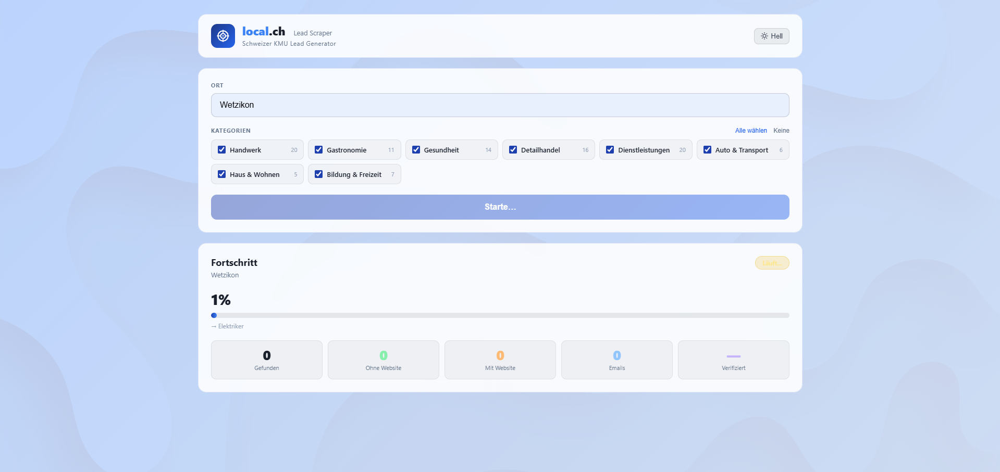

# local.ch Lead Scraper

Durchsucht **local.ch** nach Schweizer Kleinbetrieben ohne Website — inklusive Adresse, Telefon und E-Mail. Ergebnisse als CSV exportierbar.



---

## Installation

### Voraussetzungen

- [Docker Desktop](https://www.docker.com/products/docker-desktop/) muss installiert sein

---

### macOS

```bash
git clone https://github.com/mvsy/localch-scraper.git
cd localch-scraper
docker compose up --build
```

Browser öffnen: [http://localhost:8000](http://localhost:8000)

---

### Linux

```bash
git clone https://github.com/mvsy/localch-scraper.git
cd localch-scraper
docker compose up --build
```

Browser öffnen: [http://localhost:8000](http://localhost:8000)

---

### Windows

PowerShell oder CMD:

```powershell
git clone https://github.com/mvsy/localch-scraper.git
cd localch-scraper
docker compose up --build
```

Browser öffnen: [http://localhost:8000](http://localhost:8000)

---

### Stoppen

```bash
docker compose down
```
